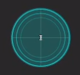

# Cursor Circle Highlight - Cairo Overlay for Ubuntu

**Version:** 1.0.0  
**Author:** Vern Six   
**License:** MIT  
**Repository:** [github.com/vernsix/cursor-circle](https://github.com/vernsix/cursor-circle)

## Overview




An open-source, customizable cursor highlight overlay for Ubuntu/Linux desktops. Creates a persistent, always-visible
circle highlight that follows your mouse cursor. Built with Python, GTK3, and Cairo graphics for optimal performance and
minimal resource usage.

## Video of Install / Use

[Click here to see video of install and use](https://youtu.be/ed8dWJn0Ttg)


## Features

- Always-visible circle around cursor
- Customizable size, color, and opacity
- Optional crosshair for precision
- Multiple rings (radar effect)
- Pulse/breathing animation
- Click-through (won't interfere with normal mouse usage)
- Lightweight and efficient
- Works across multiple monitors
- Auto-start on login

## Prerequisites

### Install Required Dependencies

```bash
sudo apt update
sudo apt install python3-gi python3-cairo python3-gi-cairo
```

## Installation

```bash
# copy the cursor highlight script to your home folder
cp cursor_circle.py ~

# make it executable
chmod +x ~/cursor_circle.py

# copy the toggle script to your home folder
cp toggle-cursor-circle.sh ~

# make it executable
chmod +x ~/toggle-cursor-circle.sh

# Run it manually to test to test
python3 ~/cursor_circle.py
```

You should see a yellow circle following your cursor. Press `Ctrl+C` in the terminal to stop it.

## Create Desktop Launcher

```bash
# copy the desktop shortcut to your desktop
cp toggle-cursor-circle.desktop ~/Desktop/toggle-cursor-circle.desktop

# Replace $USER with your actual username
sed -i "s/\$USER/$USER/g" ~/Desktop/toggle-cursor-circle.desktop

# Make it executable
chmod +x ~/Desktop/toggle-cursor-circle.desktop

# Trust the launcher (Ubuntu 22.04+)
gio set ~/Desktop/toggle-cursor-circle.desktop metadata::trusted true

# Also try this for GNOME (if needed)
gio set ~/Desktop/toggle-cursor-circle.desktop metadata::trusted-desktop-file true
```
### Add to Applications Menu

Make it searchable in the applications menu:

```bash
# Copy to applications folder
cp ~/Desktop/toggle-cursor-circle.desktop ~/.local/share/applications/
```

Now you can:
- Search for "Cursor Circle Toggle" in activities
- Pin it to your dock/panel
- Add it to favorites


## Customization Options

The script includes a **CONFIGURATION SECTION** at the top where you can easily customize everything without hunting
through the code. Just edit the values between lines 21-75.  You shouldn't have to modify anything else.

**Effects Notes:**

- **Multiple Rings**: Creates a radar/sonar appearance with concentric circles
- **Pulse Effect**: Makes the circle "breathe" by expanding and contracting
- Both effects can be combined for a dynamic radar pulse effect
- Crosshair automatically pulses with the circle when pulse is enabled

## Usage

- **Double-click** the desktop icon to toggle on/off
- **Drag to panel/dock** for quick access
- **Super key** and search "Cursor Circle Toggle"

## Keyboard Shortcut

Add a keyboard shortcut to toggle the cursor circle:

1. Open **Settings** → **Keyboard** → **Keyboard Shortcuts**
2. Click **View and Customize Shortcuts**
3. Select **Custom Shortcuts**
4. Click **Add Shortcut**
5. Set:
    - Name: `Toggle Cursor Circle`
    - Command: `/home/YOUR_USERNAME/bin/toggle-cursor-circle.sh`
    - Shortcut: `Super+H` (or your preference)

Note: Make sure you've created the toggle script from the Desktop Toggle Launcher section first.

## Quick Terminal Commands

Add these aliases to your `~/.bashrc` for easy terminal control:

```bash
echo '# Cursor circle commands
alias cursor-start="python3 ~/cursor_circle.py & echo Cursor circle started"
alias cursor-stop="pkill -f cursor_circle.py && echo Cursor circle stopped"
alias cursor-restart="cursor-stop; sleep 1; cursor-start"
alias cursor-status="pgrep -f cursor_circle.py > /dev/null && echo Running || echo Not running"' >> ~/.bashrc

# Reload bashrc
source ~/.bashrc
```

Now you can use:

- `cursor-start` - Start the circle
- `cursor-stop` - Stop the circle
- `cursor-restart` - Restart it
- `cursor-status` - Check if running

## Troubleshooting

### Circle Not Appearing

- Check if running on Wayland: `echo $XDG_SESSION_TYPE`
- If Wayland, switch to X11 session at login screen
- Verify dependencies: `python3 -c "import gi, cairo"`

### Circle Flickers

- Reduce update frequency: Change `GLib.timeout_add(10, ...)` to `20` or `30`
- Check compositor settings: `gsettings get org.gnome.desktop.interface enable-animations`

### High CPU Usage

- Increase update interval to 20-30ms
- Simplify drawing (remove glow effect)
- Check system monitor: `top -p $(pgrep -f cursor_circle)`

### Circle Wrong Position on Multi-Monitor

- Ensure all monitors are properly configured
- Check display arrangement: **Settings** → **Displays**

### Stop the Script

```bash
# Kill the process
pkill -f cursor_circle.py

# Or use the alias (if set up)
cursor-stop

# Or find and kill manually
ps aux | grep cursor_circle
kill <PID>
```

## Uninstall

To completely remove:

```bash
# Stop the script
pkill -f cursor_circle.py

# Remove main script
rm ~/cursor_circle.py

# Remove toggle script
rm ~/toggle-cursor-circle.sh

# Remove desktop launcher
rm ~/Desktop/toggle-cursor-circle.desktop

# Remove from applications menu
rm ~/.local/share/applications/toggle-cursor-circle.desktop

# Remove aliases from .bashrc (manually edit)
nano ~/.bashrc  # Remove the cursor-* aliases
```

## Performance Tips

- The script uses ~0.5-2% CPU on modern systems
- Memory usage: ~30-40MB
- No GPU acceleration needed

## Contributing

Contributions are welcome! Please feel free to submit a Pull Request. For major changes, please open an issue first to
discuss what you would like to change.

### How to Contribute

1. Fork the repository
2. Create your feature branch (`git checkout -b feature/AmazingFeature`)
3. Commit your changes (`git commit -m 'Add some AmazingFeature'`)
4. Push to the branch (`git push origin feature/AmazingFeature`)
5. Open a Pull Request

## Version History

- **v1.0.0** (2025-01-17)
    - Initial release
    - Basic circle with glow effect
    - Crosshair support
    - Multiple rings (radar effect)
    - Pulse animation
    - Full configuration system
    - Multi-monitor support
    - Desktop launcher integration

## License

This project is licensed under the MIT License - see below for details:

```
MIT License

Copyright (c) 2025 Vern Six

Permission is hereby granted, free of charge, to any person obtaining a copy
of this software and associated documentation files (the "Software"), to deal
in the Software without restriction, including without limitation the rights
to use, copy, modify, merge, publish, distribute, sublicense, and/or sell
copies of the Software, and to permit persons to whom the Software is
furnished to do so, subject to the following conditions:

The above copyright notice and this permission notice shall be included in all
copies or substantial portions of the Software.

THE SOFTWARE IS PROVIDED "AS IS", WITHOUT WARRANTY OF ANY KIND, EXPRESS OR
IMPLIED, INCLUDING BUT NOT LIMITED TO THE WARRANTIES OF MERCHANTABILITY,
FITNESS FOR A PARTICULAR PURPOSE AND NONINFRINGEMENT. IN NO EVENT SHALL THE
AUTHORS OR COPYRIGHT HOLDERS BE LIABLE FOR ANY CLAIM, DAMAGES OR OTHER
LIABILITY, WHETHER IN AN ACTION OF CONTRACT, TORT OR OTHERWISE, ARISING FROM,
OUT OF OR IN CONNECTION WITH THE SOFTWARE OR THE USE OR OTHER DEALINGS IN THE
SOFTWARE.
```

## Support

- **Bug Reports:** [GitHub Issues](https://github.com/vernsix/cursor-circle/issues)
- **Feature Requests:** [GitHub Issues](https://github.com/vernsix/cursor-circle/issues)
- **Discussions:** [GitHub Discussions](https://github.com/vernsix/cursor-circle/discussions)

## Compatible With

- ✅ Ubuntu 20.04, 22.04, 24.04
- ✅ X11 sessions (full support)
- ⚠️ Wayland (limited support, may need XWayland)
- ✅ Multiple monitor setups
- ✅ High DPI displays (may need size adjustments)

---

*Created for Ubuntu desktop environments using GTK3 and Cairo graphics*

